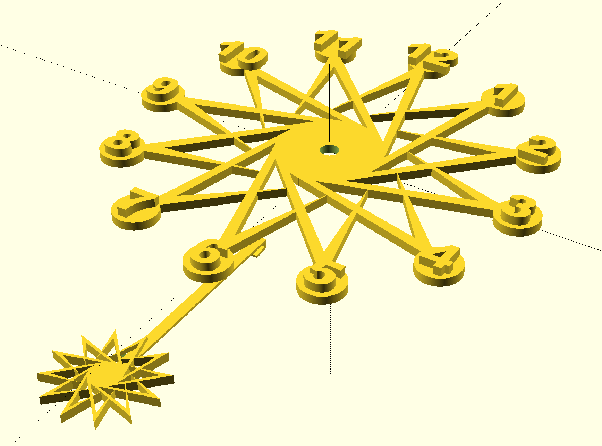

# OpenSCAD_Clock

OpenSCADで時計の文字盤作成

## CLOCK 001

- clock_001 (文字盤)
- clock_swingbar (振り子のバー)
- clock_001_swing (振り子オーナメント）

## 投げ銭

データをご利用の方は是非投げ銭お願いします！

[Amazonギフト券](https://amzn.to/39yuS50)  
受取人に、 `giftforseya+clock@gmail.com`を入れてください。  
15円から投げ銭可能ですので、気に入ったらよろしくお願いします。
